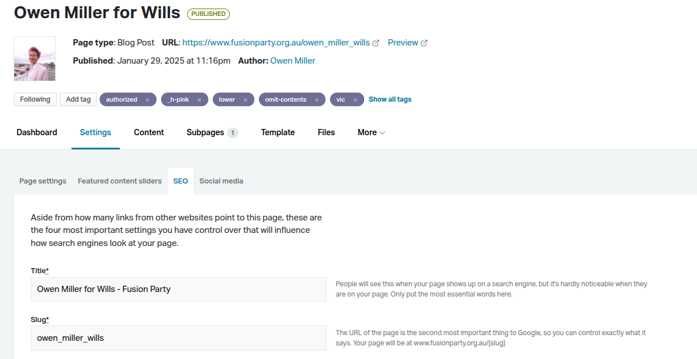
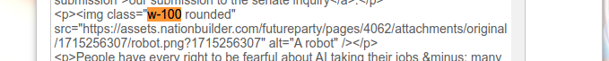

# Website theme
The files here constitute a NationBuilder theme.

The theme in this repository has been initialised as an export of NationBuilder's default Bootstrap 4 theme and has diverged with each commit.

To update the theme for a NationBuilder site, you're required to replace the theme's files.

## Updating a Theme
* https://support.nationbuilder.com/en/articles/2331534-create-a-website-theme-with-nationbuilder
* https://nationbuilder.com/liquid

For submitting a theme, notice [here](https://themes.nationbuilder.com/submit_a_theme) that NationBuilder provides
[a checklist](https://docs.google.com/spreadsheets/d/1w1bapRzF5Y1HBbc9TypQJhAxcVD4rW7mj_5rbmnyNVk/edit#gid=0) of what the theme should include.

## Usage Guide
There was originally a design to create a whole replacement for NationBuilder, but in implementing a specific
front-end design for that system, it was deemed sensible to first apply the designs as a template in NationBuilder. This
would allow the new look to be implemented sooner, which was the main objective.

As such, using this theme involves doing a lot of actions which don't have nice buttons for you to press − you'll need
to modify some HTML yourself and add various tags to trigger functionality. The end result for visitors is far more
important than the ease of editing the content.

So, with that in mind, here are some of the ways to update a page to make it shine:

### Adding Pages
When adding any page, ensure that you're updating NationBuilder's "SEO" and "Social media" settings, as these
define the [Open Graph](https://ogp.me/) attributes for previewing the pages elsewhere (including previews for search 
results and social-media posts).

Fusion's account for [Google Search Console](https://search.google.com/) is managed by Owen. There, we can keep track of
what users are search for, before arriving at our page. It should be more than just "Fusion Party"! 🙀



### Headings
Notice that the headings are animated. This is done by adding class `h-underline` and a colour (eg `h-pink`)
explicitly in the editor (you'll need to click "Source code" to get to this.)


The available heading colours are defined in [styles.css](./styles.css). At the time of writing, they are:
* h-pink (hot pink)
* h-purple (royal purple)
* h-blue (dark blue)
* h-gray
* h-aquamarine (not "teal"!)

For headings which are close together and will probably appear on the screen together at the same time, it's good to
add the class `transition-delay` to the second one onwards − this will slightly delay the underlining animation.

Please use the same colour throughout the page − it has been attempted to mix and match, and it's very hard to make it
look good.

For changing the colour of the page title, you'll need to add it as a tag with a `_` prefix (this will be discussed in 
more detail later):


### Body Imagery
Images in the body can use classes `w-100` and `w-50`. **Make sure you remove any explicit width and height styles that NationBuilder might've imposed**, otherwise the aspect ratio can get messed up.

> 

Whenever you upload an image to NationBuilder, it will create explicit width and height values that only fit on your
screen, not on mobile.

### Header Imagery
The policy pages have headers with background imagery. Notice that it's rendered as a srcset with two images, eg:
* https://fusionparty.space/images/kangaroo_future_scenery_200.webp  (725 × 200 px)
* https://fusionparty.space/images/kangaroo_future_scenery.webp (2176 × 544)
In the srcset, the browser is being told to use the `_200` image for screen widths up to 725px − this was calibrated 
based on the site's responsive CSS and the fact that all these images have an aspect ratio of 4:1.

If you'd like to use a header image for a new page, then please keep in mind the aspect ratio and the requirement to
upload the two images to [Cloudflare R2](https://dash.cloudflare.com/ea5bd9ef975707ea2e4d11229641a447/r2/default/buckets/fusion-assets) 

> The srcset needs to be fixed, these 200-pixel images are all tagged `725w` even though they're not necessarily 725w.
> Then in turn, it's always the large one being used.


On the NationBuilder page 
[Future Focused](https://futureparty.nationbuilder.com/admin/sites/2044/pages/3424/attachments), there's a file with the
name `hero_cloudfront_kangaroo_future_scenery.webp` − this is interpreted by our template to mean that we would like to
use an image `kangaroo_future_scenery.webp` in the header as a hero image, and that there is an equivalent image in
Cloudfront. Sure we could've served the image from NationBuilder, but by using Cloudfront, it's under Owen's control and
we can serve images from data centres all over Australia. Most (all?) of the requests to NationBuilder have to bounce
across the Pacific Ocean, to San Francisco.

### Candidate Pages
Notice that the page /candidates features filters for states and lower house / upper house − these rely on tags on the
page for each candidate: `nsw`, `qld`, `sa`, `vic`, `wa`, `lower`, `upper`.

Besides the earlier instructions in _Adding Pages_, note that candidate pages require a thumbnail to be defined in 
[this template](https://github.com/Fusion-Party-Aus/colourful_fusion_theme/blame/master/pages_show_candidates.html#L94).

This limitation is because the `blog_post` object 
[lacks access to attachments](https://nationbuilder.com/blog_post_page_variables) such as images, and although the
blog-post content probably includes an `` that we can identify with string processing, NationBuilder remembers that
this string is essentially off-limits and won't let us use it on our page as eg an img's `src` − it ends up always
escaping the string.

So the most practical way around this is to hard-code a correspondence of candidate names to thumbnail images.

### Importing Extra CSS
For any rare visualisations, these are probably being performed by CSS files which need to be explicitly added to a page
through the use of tags


The tags used to show at the bottom of pages, linking users to similar topics, but it has proved the most practical
method for editors to convey signals to the underlying template system, so the "tag as a topic" idea has been hijacked.
The tag for heading colours starts with a `_` prefix to indicate that it's not for displaying to end users (similar to 
Python conventions), but this idea only came later in the implementation process and hasn't been spread to other tags.

You'll notice this pattern in some templates:
```liquid

…

    
      
        
    

…

<link rel="stylesheet" href="https://fusionparty.space/styles/minified/ballots.65fc4ec6.min.css"
      crossorigin="anonymous"
      referrerpolicy="no-referrer">

```
By relying on a tag to decide if the extra resources should be loaded, it allows the pages to stay small and (most 
importantly) fast.

We can see all the available tags (plus other unrelated variables) by running this command:
```shell
grep --perl-regexp " = false %}" *.html | grep --only-matching --perl-regexp "\{% [^\}]+\}" | sort --unique
```
So at the time of writing, the available UI tags which you might use are:
* blob − is there an image on the page which will be surrounded by a slowly moving blob frame?

  
  * See also that you can add the `wobble` class to a div before the `img`, giving it this wobbling gradient background:
  ```html
  <div class="col-12 col-md-5 col-lg-6 d-flex justify-content-center align-items-center blob-container">
    <div class="blob wobble">
      
    </div>
  </div>
  ```
  
* glow − are there buttons on the page which glow?
  
  Some people have complained that the glowing buttons might be an issue for those with epilepsy. Please don't be
  distracted by armchair experts with no skin in this game. We need to be doing **_everything possible_** to increase
  our conversion rates, and we shouldn't be handicapping ourselves based on pure _speculation_ from someone with no
  expertise in the startup space and no insight into how any of these disabilities actually play out in practice.
* kwes − should we include a Kwes form? These get sent to contact@fusionparty.org.au. The account is managed by Owen.
* omit-contents − should we omit the table of contents (on the left of the screen)?
* wide − should we allow the page to be displayed a bit wider than usual? Not all pages support this.
